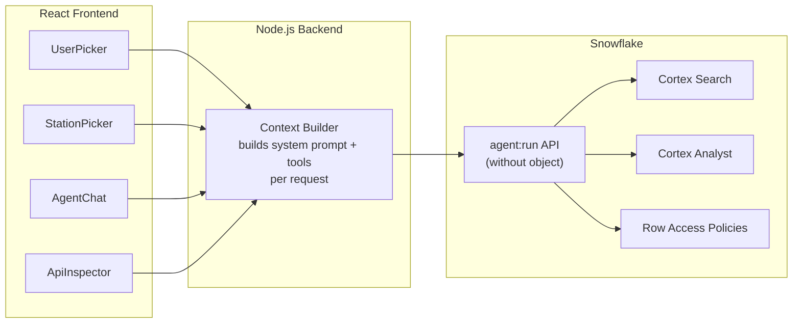

# Agent Multicontext Demo


When a customer asks for multitenant AI -- different users, different permissions, different brands, all through one application -- it can feel heavy before you've even started. This demo shows it doesn't have to be.

**One endpoint. Infinite profiles.** A working React + Node.js app backed by the Snowflake Agent Run API's "without agent object" endpoint, where every request carries its own system prompt, tool set, and RBAC role. Three layers make it work: **Authenticate** (reuse the app's existing auth), **Build** (assemble the right payload per request), **Experience** (change everything without reloading).

**Pair-programmed by:** SE Community + Cortex Code
**Created:** 2026-03-03 | **Expires:** 2026-04-02 | **Status:** ACTIVE

> **No support provided.** This code is for reference only. Review, test, and modify before any production use.
> This demo expires on 2026-04-02. After expiration, validate against current Snowflake docs before use.

---

## The Problem

A public television network runs four local stations -- WETA, KQED, WGBH, WNET. Each station has its own brand, its own member base, and its own viewership data. They want one AI support experience across all four stations.

Their public-facing app already handles authentication -- anonymous visitors, logged-in members, and station admins all hit the same application. Asking them to rebuild their entire access plane in Snowflake with Azure AD and External OAuth is an invasive, heavy lift. It's not the right move for their existing architecture.

And then there's the anonymous user problem. Snowflake requires a role and a session for every query. Public apps have visitors who aren't logged in at all. The common workaround -- prepending *"remember, my user ID is 42"* into every message -- is fragile, pollutes conversation history, and mixes data with intent.

The key realization: their app already knows everything we need. The question isn't *"how do we recreate identity in Snowflake"* -- it's *"how do we pass it through."*

---

## The Pattern: Authenticate, Build, Experience

The answer is an endpoint most of us haven't reached for yet: `POST /api/v2/cortex/agent:run` -- no agent object, no pre-registration. You send the entire agent specification inline per request. The app becomes the context builder. Snowflake is the engine.

### Layer 1: Authenticate -- Reuse, Don't Recreate

The customer's app already handles auth. Don't rebuild it -- just pass the identity through. Each tier maps to a Snowflake role via the `X-Snowflake-Role` header, which activates Row Access Policies at the SQL layer. No External OAuth required.

| Tier | Who they are | Snowflake Role |
|------|-------------|----------------|
| **Anonymous** | No user ID | _(default)_ |
| **Basic Member** | User ID + name | `TV_VIEWER_ROLE` |
| **Station Admin** | User ID + admin flag | `TV_ADMIN_ROLE` |

> [!TIP]
> **Pattern demonstrated:** `X-Snowflake-Role` header + Row Access Policies for per-request RBAC -- data isolation enforced at the SQL layer, invisible to the agent.

### Layer 2: Build -- Capabilities Change by Role

A thin proxy reads the user's tier and assembles the full API request on the fly. The `instructions.system` field carries per-request identity and branding. The `tools` array changes based on who's asking. The `X-Snowflake-Role` header sets the execution role. All per-request.

```json
{
  "instructions": {
    "system": "You are the WETA Support Agent. The current user is Jane (member ID 42).",
    "response": "Be friendly and reference WETA programming.",
    "orchestration": "Use Cortex Analyst for viewership questions."
  },
  "tools": [ ... ],
  "tool_resources": { ... }
}
```

| Tier | Tools Available |
|------|----------------|
| **Anonymous** | Cortex Search (KB) only |
| **Basic Member** | Search + Analyst (viewership) |
| **Station Admin** | Search + full Analyst (metrics, members) |

The agent literally cannot call a tool it wasn't given.

> [!TIP]
> **Pattern demonstrated:** `instructions.system` for identity injection + dynamic `tools` array -- the production alternative to stuffing context into user messages.

### Layer 3: Experience -- Change Everything Without Reloading

Switch roles, switch stations, and the very next message carries completely new context. No page refresh. No new session. The UI stays put and the payload changes underneath.

That's only possible because nothing is locked in an agent object. The `agent:run` endpoint most of us reach for takes a path to a named object whose instructions and tools are fixed at creation time. The "without agent object" variant accepts the full spec inline. That's the unlock.

A sidebar **API Inspector** shows the exact JSON payload sent to Snowflake on every turn -- toggle between `instructions`, `tools`, and the full request body to see how context changes as you switch users and stations.

> [!TIP]
> **Pattern demonstrated:** One codebase, one endpoint, four stations, three tiers -- every combination assembled fresh on every turn.

---

## Architecture



---

## Explore the Results

After deployment, three interfaces let you explore the demo:

- **React App** -- Switch users, switch stations, chat with the agent, and inspect the live API payload. The app URL is shown in the final output of `deploy_spcs.sql`.
- **API Inspector** -- Toggle between `instructions`, `tools`, and `full payload` tabs to see exactly what changes per request.
- **Observability Queries** -- Paste queries from `sql/07_observability_queries.sql` into Snowsight to see agent credits, token usage, and Analyst request logs.

| What | Source | Scope |
|------|--------|-------|
| Agent credits and token usage | `SNOWFLAKE.ACCOUNT_USAGE.CORTEX_AGENT_USAGE_HISTORY` | All `agent:run` calls (with and without object) |
| Cortex Analyst request logs | `SNOWFLAKE.LOCAL.CORTEX_ANALYST_REQUESTS()` table function | Scoped to a semantic view |
| Conversation history | Thread REST API (`GET /api/v2/cortex/threads/{id}/messages`) | Per thread |

---

<details>
<summary><strong>Deploy (4 steps, ~10 minutes)</strong></summary>

> [!IMPORTANT]
> Requires **Enterprise** edition, `SYSADMIN` + `ACCOUNTADMIN` role access, and Cortex AI enabled in your region.

**Step 1 -- Deploy Snowflake objects:**

Copy [`deploy_all.sql`](deploy_all.sql) into a Snowsight worksheet and click **Run All**.

**Step 2 -- Build and push the container image:**

```bash
./tools/push.sh
```

Builds the Docker image and pushes it to the Snowflake image repository. The repo URL is shown in the final output of Step 1.

**Step 3 -- Create the SPCS service:**

Run [`deploy_spcs.sql`](deploy_spcs.sql) in Snowsight. The final output shows the app URL.

**Step 4 -- Cleanup:**

Run [`teardown_all.sql`](teardown_all.sql) in Snowsight.

### What Gets Created

| Object Type | Name | Purpose |
|---|---|---|
| Schema | `SNOWFLAKE_EXAMPLE.AGENT_MULTICONTEXT` | Demo schema |
| Warehouse | `SFE_AGENT_MULTICONTEXT_WH` | Demo compute |
| Tables | `STATION_INFO`, `PROGRAMMING_SCHEDULE`, `VIEWERSHIP_METRICS`, `MEMBER_ACCOUNTS`, `SUPPORT_ARTICLES`, `USER_STATION_MAPPING` | Source data |
| Cortex Search Service | `SUPPORT_KB_SEARCH` | Knowledge base search |
| Semantic View | `SV_AGENT_MULTICONTEXT_VIEWERSHIP` | Viewership analytics for Cortex Analyst |
| Row Access Policies | `STATION_VIEWERSHIP_POLICY`, `STATION_MEMBER_POLICY` | Station-scoped data isolation |
| Roles | `TV_VIEWER_ROLE`, `TV_ADMIN_ROLE` | Authorization tiers |
| Image Repository | `IMAGES` | Container image storage |
| Compute Pool | `SFE_AGENT_MULTICONTEXT_POOL` | SPCS compute |
| Service | `AGENT_APP` | Web application (created by `deploy_spcs.sql`) |

### Estimated Costs

| Component | Size | Est. Credits/Hour |
|---|---|---|
| Warehouse (SFE_AGENT_MULTICONTEXT_WH) | X-SMALL | 1 |
| Compute Pool (SFE_AGENT_MULTICONTEXT_POOL) | CPU_X64_XS | ~0.6 |
| Cortex Search Service | Serverless | ~0.1 |
| Cortex Agent calls | Per-query | ~0.01/query |
| Cortex Analyst calls | Per-query | ~0.01/query |
| **Total** | | **~2 credits** for full deployment + 1 hour of exploration |

### Operations

| Script | Purpose |
|--------|---------|
| `./tools/push.sh` | Build and push container image to Snowflake |
| `./tools/push.ps1` | Same, for Windows (PowerShell) |
| [`deploy_spcs.sql`](deploy_spcs.sql) | Create/redeploy the SPCS service |
| `sql/07_observability_queries.sql` | Ad-hoc observability queries (run individually in Snowsight) |

</details>

<details>
<summary><strong>Troubleshooting</strong></summary>

| Symptom | Fix |
|---------|-----|
| Service stays in PENDING | Check compute pool status: `SHOW COMPUTE POOLS`. Pool may still be provisioning. |
| `ingress_url` is NULL | Service is still starting. Re-run `SHOW ENDPOINTS IN SERVICE AGENT_APP` after a minute. |
| "Failed to create thread" in chat | Verify PAT is valid and not expired. |
| Agent returns empty responses | Cortex Search service needs time to index after deploy. Wait a few minutes and retry. |
| Analyst tool errors | Verify `SFE_AGENT_MULTICONTEXT_WH` is running and the semantic view exists in `SEMANTIC_MODELS`. |
| Build crashes with `lfstack.push` | Apple Silicon + `--platform linux/amd64` on the build stage. The Dockerfile builds Stage 1 natively to avoid this. |

</details>

## Cleanup

1. Run [`teardown_all.sql`](teardown_all.sql) in Snowsight

<details>
<summary><strong>Development Tools</strong></summary>

This project is designed for AI-pair development.

- **AGENTS.md** -- Project instructions for Cortex Code and compatible AI tools
- **.claude/skills/** -- Project-specific AI skills (Cursor + Claude Code)
- **Cortex Code in Snowsight** -- Open this project in a Workspace for AI-assisted development
- **Cursor** -- Open locally with Cursor for AI-pair coding

> New to AI-pair development? See [Cortex Code docs](https://docs.snowflake.com/en/user-guide/cortex-code/cortex-code)

</details>

## References

- [Cortex Agents Run API](https://docs.snowflake.com/en/user-guide/snowflake-cortex/cortex-agents-run) -- `agent:run` with and without agent object
- [Cortex Agents REST API](https://docs.snowflake.com/en/user-guide/snowflake-cortex/cortex-agents-rest-api) -- CRUD operations for agent objects
- [Monitor Cortex Agent Requests](https://docs.snowflake.com/en/user-guide/snowflake-cortex/cortex-agents-monitor) -- Observability and tracing (requires agent object)
- [CORTEX_AGENT_USAGE_HISTORY](https://docs.snowflake.com/en/sql-reference/account-usage/cortex_agent_usage_history) -- Usage view for all `agent:run` calls
- [Cortex Analyst Administrator Monitoring](https://docs.snowflake.com/en/user-guide/snowflake-cortex/cortex-analyst/admin-observability) -- Analyst request logs and SQL queries
- [Setting Execution Context](https://docs.snowflake.com/en/developer-guide/snowflake-rest-api/setting-context) -- X-Snowflake-Role and X-Snowflake-Warehouse headers

## Related Projects

Three projects in this repo cover Cortex Agent context and multi-tenancy. This demo is the runnable one.

| | This project | [guide-api-agent-context](../guide-api-agent-context/) | [guide-agent-multi-tenant](../guide-agent-multi-tenant/) |
|---|---|---|---|
| **Type** | Runnable demo | Code snippet guide | Architecture guide |
| **API Approach** | Without agent object | Both (with + without) | With agent object |
| **What Changes Per Request** | System prompt, tools, role, and instructions | Role + warehouse headers | Authenticated identity (RAP filtering) |
| **Auth Pattern** | Simulated user picker | PAT / OAuth / Key-Pair JWT snippets | Azure AD + External OAuth (production) |
| **Data Isolation** | Row Access Policies via X-Snowflake-Role | Not implemented | Row Access Policies via CURRENT_USER() |
| **Start here if...** | "I want to see and show context injection" | "I need the API syntax" | "I'm designing a production app" |

## License

Apache 2.0 -- See individual file headers for details.
